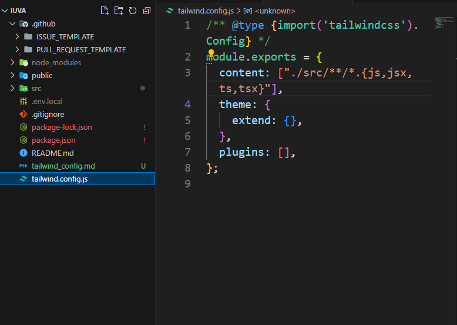
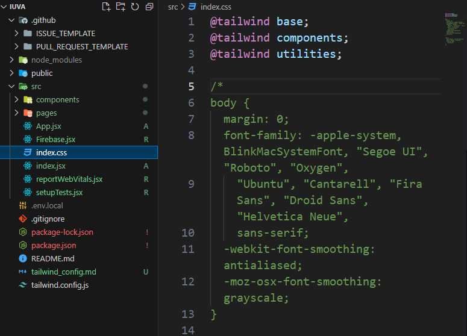

# Description

For config of the Tailwind via Create React App
* Follow numerated instructions in Install Tailwind CSS with Create React App
* Creating React App, Installing Tailwind and init
* Configure template paths by changing `content` in `tailwind.config.js` file, adding base-components-utilities into `./src/index.css`
* And run npm

## Related Issue

Fixes #

## Screenshots

## Type of change

Please delete options that are not relevant.

- [ ] Bug fix (non-breaking change which fixes an issue)
- [ ] New feature (non-breaking change which adds functionality)
- [ ] Breaking change (fix or feature that would cause existing functionality to not work as expected)

# How Has This Been Tested?

Please describe the tests that you ran to verify your changes. Provide instructions so we can reproduce. Please also list any relevant details for your test configuration

- [ ] Tested locally
- [ ] Added tests

# Checklist:

- [ ] My code follows the style guidelines of this project
- [ ] I have performed a self-review of my own code
- [ ] I have commented my code, particularly in hard-to-understand areas
- [ ] My changes generate no new warnings
- [ ] New and existing unit tests pass locally with my changes
- [ ] I've run linter, prettier, and removed all `console.log`
- [ ] I've reverted all the files back that are not related to the issue (App.js, index.js, ...)
